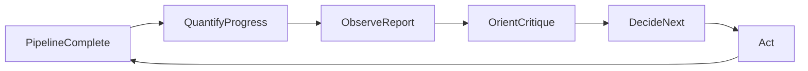

# Colab cells: essential pipeline (functional, bug-free)

Clone the repo, set `PYTHONPATH` to `slop_src`, and run these cells in order. No `%%writefile` or patch cells needed. Repo layout: `slop_configs/`, `slop_scripts/`, `slop_src/slop/`.

---

## Cell 1 — GPU check

```python
# GPU check: Torch version and CUDA. Required for training.
import torch
print("Torch:", torch.__version__, "| CUDA:", torch.cuda.is_available())
if torch.cuda.is_available():
    print("GPU:", torch.cuda.get_device_name(0))
else:
    print("No GPU. In Colab: Runtime → Change runtime type → T4 GPU")
```

---

## Cell 2 — Clone repo and set root

```python
# Clone repo into PROJECT_ROOT and cd there so all later commands run from repo root.
REPO_URL = "https://github.com/ian-lent/slop-minimization.git"
PROJECT_ROOT = "/content/slop-repo"

%cd /content
!rm -rf /content/slop-repo
!git clone $REPO_URL $PROJECT_ROOT
%cd $PROJECT_ROOT
print("Project root:", PROJECT_ROOT)
```

---

## Cell 3 — Install dependencies

```python
# Install PyTorch and slop pipeline deps (transformers, datasets, peft, etc.).
!pip -q install --upgrade pip
!pip -q install torch torchvision torchaudio
!pip -q install transformers datasets peft accelerate pyyaml tqdm scikit-learn sentencepiece
```

---

## Cell 4 — Verify layout

```python
# Confirm cwd is repo root and slop_configs, slop_scripts, slop_src exist.
!pwd
!ls slop_configs slop_scripts slop_src
```

---

## Cell 5 — Build data

```python
# Build train/val/test JSONL in data/; each line has "text" and "labels" (word-level 0/1).
!cd $PROJECT_ROOT && PYTHONPATH=$PROJECT_ROOT/slop_src python slop_scripts/build_data.py --output-dir data
!ls $PROJECT_ROOT/data
!wc -l $PROJECT_ROOT/data/train.jsonl $PROJECT_ROOT/data/val.jsonl $PROJECT_ROOT/data/test.jsonl
```

---

## Cell 6 — Train classifier (saves to outputs/classifier_curriculum)

```python
# Train DistilBERT classifier (curriculum); saves pytorch_model.bin + tokenizer to outputs/classifier_curriculum.
!cd $PROJECT_ROOT && PYTHONPATH=$PROJECT_ROOT/slop_src python slop_scripts/train_token_classifier.py \
  --config slop_configs/classifier_encoder.yaml \
  --output-dir outputs/classifier_curriculum
!ls -la $PROJECT_ROOT/outputs/classifier_curriculum/
```

---

## Cell 7 — Generate slop pairs for T5

```python
# Generate (human, slop) pairs from train.jsonl for T5 rewriter training.
!cd $PROJECT_ROOT && PYTHONPATH=$PROJECT_ROOT/slop_src python slop_scripts/train_slop_generator.py generate \
  --input data/train.jsonl --output data/slop_pairs.jsonl
!wc -l $PROJECT_ROOT/data/slop_pairs.jsonl
```

---

## Cell 8 — Train T5 slop rewriter (saves to outputs/slop_rewriter)

```python
# Train T5 on slop pairs; saves model + tokenizer to outputs/slop_rewriter.
!cd $PROJECT_ROOT && PYTHONPATH=$PROJECT_ROOT/slop_src python slop_scripts/train_slop_generator.py train \
  --train-path data/slop_pairs.jsonl \
  --output-dir outputs/slop_rewriter \
  --model-name t5-small --epochs 3
!ls -la $PROJECT_ROOT/outputs/slop_rewriter/
```

---

## Cell 9 — Prompt optimization

```python
# Hill-climb prompts with TinyLlama + classifier reward; saves best prompts to outputs/prompt_opt.
!cd $PROJECT_ROOT && PYTHONPATH=$PROJECT_ROOT/slop_src python slop_scripts/optimize_prompts.py \
  --config slop_configs/prompt_opt.yaml
!ls -la $PROJECT_ROOT/outputs/prompt_opt/
```

Ensure `slop_configs/prompt_opt.yaml` has `reward.checkpoint_path: outputs/classifier_curriculum` so the trained classifier is used as the reward model.

---

## --- Show progress ---

*Where the model is relative to the end goal:* report + implementation + critique/iteration (OODA: Observe → Orient → Decide → Act). The pipeline is complete (data built, classifier trained, T5 rewriter trained, prompt optimization run); artifacts are on disk. The next step is **Observe** (quantify current performance), then iterate. The cells below are ways to quantify that progress.

### Progress diagram (current state vs end goal)



**You are here:** Quantify / Show progress — run the cells below to get classifier eval, reward-model stats, and prompt-opt summary, then continue to zip/Drive or iterate.

---

### Cell: Classifier eval (mean reward, sequence accuracy)

```python
# Show progress: evaluate classifier on test set (mean_reward, sequence_accuracy, n_samples).
!cd $PROJECT_ROOT && PYTHONPATH=$PROJECT_ROOT/slop_src python slop_scripts/eval.py \
  --classifier-path outputs/classifier_curriculum \
  --test-path data/test.jsonl \
  --output-path outputs/eval_results.json
```

---

### Cell: Reward model stats on test set

```python
# Show progress: score test set with reward model; report mean/std and optional top/bottom examples.
!cd $PROJECT_ROOT && PYTHONPATH=$PROJECT_ROOT/slop_src python slop_scripts/eval_reward_model.py \
  --data data/test.jsonl \
  --checkpoint outputs/classifier_curriculum \
  --show-examples 3
```

---

### Cell: Prompt-opt run summary

```python
# Show progress: summarize latest prompt-optimization run (best prompts file, run dir).
from pathlib import Path
opt_dir = Path("outputs/prompt_opt")
if not opt_dir.exists():
    print("outputs/prompt_opt not found.")
else:
    run_dirs = sorted([d for d in opt_dir.iterdir() if d.is_dir() and d.name.startswith("run_")], reverse=True)
    if not run_dirs:
        print("No run_* subdirs in outputs/prompt_opt.")
    else:
        latest = run_dirs[0]
        best_file = latest / "best_prompts.json"
        if best_file.exists():
            import json
            data = json.loads(best_file.read_text())
            n = len(data) if isinstance(data, (list, dict)) else 0
            key = list(data.keys())[0] if isinstance(data, dict) and data else "—"
            print(f"Latest run: {latest.name}, best_prompts.json: {n} entries, first key: {key}")
        else:
            print(f"Latest run: {latest.name}. No best_prompts.json found.")
```

---

### Cell (optional): Progress summary table

```python
# Show progress: print a short summary table of artifacts and metrics (paths, eval results if available).
from pathlib import Path
import json
paths = ["outputs/classifier_curriculum", "outputs/slop_rewriter", "outputs/prompt_opt"]
eval_path = Path("outputs/eval_results.json")
test_path = Path("data/test.jsonl")
n_test = sum(1 for _ in test_path.open()) if test_path.exists() else 0
print("Artifact paths:")
for p in paths:
    exists = Path(p).exists()
    print(f"  {p}: exists={exists}")
print(f"Test set size: {n_test}")
if eval_path.exists():
    d = json.loads(eval_path.read_text())
    print(f"mean_reward: {d.get('mean_reward', '—')}")
    print(f"sequence_accuracy: {d.get('sequence_accuracy', '—')}")
else:
    print("eval_results.json not found (run classifier-eval cell first).")
```

---

## Cell 10 — Zip critical artifacts for download

```python
# Zip outputs/ (classifier_curriculum, slop_rewriter, prompt_opt) for download so weights persist after session.
import os
import shutil
from pathlib import Path

os.chdir(PROJECT_ROOT)
for d in ["outputs/classifier_curriculum", "outputs/slop_rewriter", "outputs/prompt_opt"]:
    p = Path(d)
    print(f"{d}: exists={p.exists()}")
zip_path = Path("slop_critical_artifacts.zip")
if zip_path.exists():
    zip_path.unlink()
shutil.make_archive(zip_path.with_suffix(""), "zip", "outputs")
print(f"Saved: {zip_path.resolve()}")
print("Download this zip from the Colab file browser.")
```

---

## Optional — Copy to Google Drive

```python
# Optional: copy classifier_curriculum, slop_rewriter, prompt_opt to Drive for persistence across sessions.
from google.colab import drive
drive.mount("/content/drive", force_remount=False)

DRIVE_BASE = "/content/drive/MyDrive/slop_pipeline"
Path(DRIVE_BASE).mkdir(parents=True, exist_ok=True)

for name, src in [
    ("classifier_curriculum", "outputs/classifier_curriculum"),
    ("slop_rewriter", "outputs/slop_rewriter"),
    ("prompt_opt", "outputs/prompt_opt"),
]:
    src_path = Path(src)
    if src_path.exists():
        dst = Path(DRIVE_BASE) / name
        dst.mkdir(parents=True, exist_ok=True)
        shutil.copytree(src_path, dst, dirs_exist_ok=True)
        print(f"Copied {name} → {dst}")
print(f"Artifacts saved under {DRIVE_BASE}")
```

---

**Essential models trained:** (1) classifier → `outputs/classifier_curriculum`, (2) T5 rewriter → `outputs/slop_rewriter`, (3) prompt optimization → `outputs/prompt_opt`. Weights are saved by the scripts; zip or Drive copy persists them after the session.
